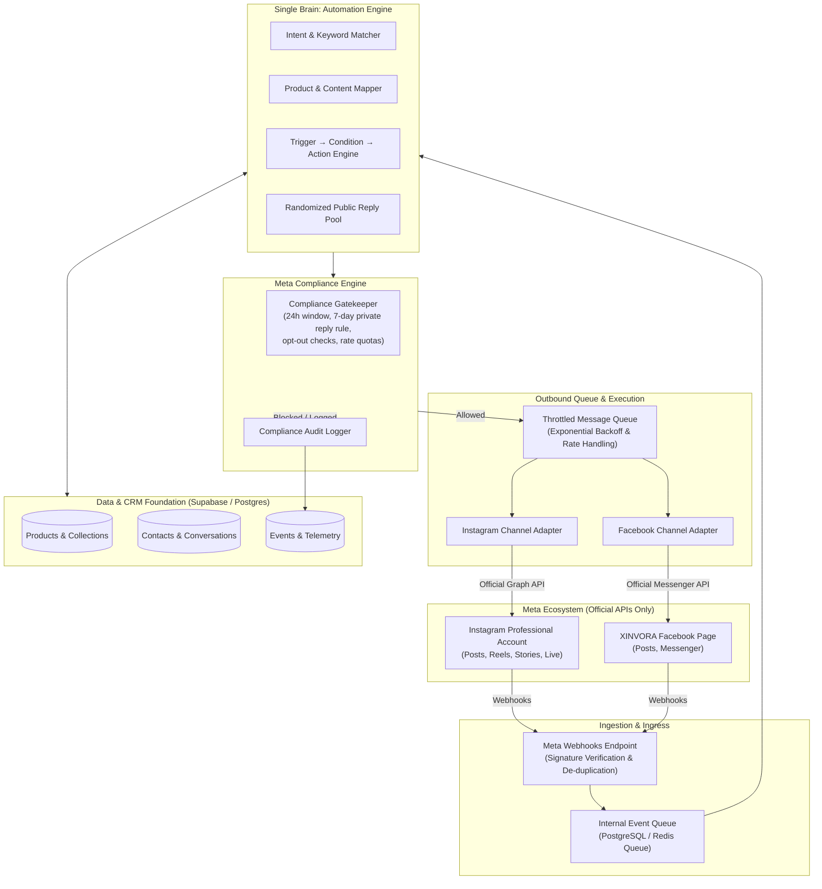

# XINVORA Social Commerce Automation Platform

> **A first-party, compliance-first social commerce automation engine connecting Instagram & Facebook with product catalogs, automated DM funnels, CRM, and real-time conversion analytics.**

---

## 🤖 AI Vibe Coding & Agent Configuration

If you are using an AI assistant (Antigravity, Cursor, Windsurf, Claude Code, GitHub Copilot) to build this application:
- [**AGENTS.md**](file:///Users/nagarro/Desktop/INSTA%20XIN/AGENTS.md) — Master AI Coding Rules, Architectural Invariants & Non-Negotiables.
- [**.cursorrules**](file:///Users/nagarro/Desktop/INSTA%20XIN/.cursorrules) — AI IDE context rules file.
- [**16. AI Prompting & Vibe Coding Playbook**](file:///Users/nagarro/Desktop/INSTA%20XIN/docs/16-ai-prompting-and-vibe-coding-guide.md) — Step-by-step milestone prompts for fast, error-free AI code generation.
- [**17. Project File Structure & Blueprint**](file:///Users/nagarro/Desktop/INSTA%20XIN/docs/17-project-file-structure.md) — Canonical directory layout, file locations, and responsibilities.

---

## 📖 Complete Documentation Suite (17 Modules)

| # | Document Module | Category | Primary Focus & Contents |
| :-: | :--- | :--- | :--- |
| **01** | [**Product Philosophy & Scope**](file:///Users/nagarro/Desktop/INSTA%20XIN/docs/01-product-philosophy-and-objectives.md) | Vision & Scope | Commerce philosophy, MVP scope vs. deferred items, success criteria. |
| **02** | [**Meta Compliance & Anti-Ban**](file:///Users/nagarro/Desktop/INSTA%20XIN/docs/02-meta-compliance-and-anti-ban.md) | Safety & Policy | Meta 24h & 7-day rules, Compliance Gatekeeper, rate limits, 20 non-negotiables. |
| **03** | [**System Architecture & Tech Stack**](file:///Users/nagarro/Desktop/INSTA%20XIN/docs/03-system-architecture-and-tech-stack.md) | Core Engineering | "Single Brain, Multiple Channels", Next.js/Supabase stack, Meta OAuth, token vault. |
| **04** | [**Database Schema & Entities**](file:///Users/nagarro/Desktop/INSTA%20XIN/docs/04-database-schema-and-entities.md) | Data Layer | 20+ PostgreSQL tables (products, content maps, CRM, queues, audit logs). |
| **05** | [**Event Pipeline & Reliability**](file:///Users/nagarro/Desktop/INSTA%20XIN/docs/05-event-pipeline-queues-and-reliability.md) | Ingestion & Queues | Webhook signature check, SHA-256 idempotency, burst throttling, retry matrix. |
| **06** | [**Automation Engine & Workflows**](file:///Users/nagarro/Desktop/INSTA%20XIN/docs/06-automation-engine-and-workflows.md) | Rules & Logics | Trigger-Condition-Action engine, comment-to-DM flow, anti-repeat pools, test simulator. |
| **07** | [**Marketing Campaigns & CRM**](file:///Users/nagarro/Desktop/INSTA%20XIN/docs/07-marketing-campaigns-and-crm.md) | Customer Lifecycle | Audience eligibility, Meta-compliant campaigns, Unified Inbox, automated handoff. |
| **08** | [**Analytics & Admin Dashboard**](file:///Users/nagarro/Desktop/INSTA%20XIN/docs/08-analytics-and-admin-dashboard.md) | Reporting & UI | Funnel metrics, event taxonomy, UTM tracking, management UI specs. |
| **09** | [**Future Roadmap & AI Layer**](file:///Users/nagarro/Desktop/INSTA%20XIN/docs/09-future-roadmap-ai-and-integrations.md) | Future & Execution | 13-phase development plan, AI intelligence layer, inventory sync, visual builder. |
| **10** | [**API Reference & Contracts**](file:///Users/nagarro/Desktop/INSTA%20XIN/docs/10-api-reference-and-contracts.md) | API Specs | Complete REST & Server Action contracts, request/response formats, error codes. |
| **11** | [**Meta App Review Guide**](file:///Users/nagarro/Desktop/INSTA%20XIN/docs/11-meta-app-review-and-permissions-guide.md) | App Review & Legal | Permission justification, screencast walkthroughs, privacy & data deletion callbacks. |
| **12** | [**Deployment & Security**](file:///Users/nagarro/Desktop/INSTA%20XIN/docs/12-deployment-environment-and-security.md) | DevOps & Security | `.env.example`, AES-256 token encryption at rest, Vercel & Supabase configuration. |
| **13** | [**Testing & QA Simulation**](file:///Users/nagarro/Desktop/INSTA%20XIN/docs/13-testing-qa-and-simulation-guide.md) | QA & Validation | Unit/Integration testing, cURL mock webhook generator, viral load burst testing. |
| **14** | [**Operational Runbook**](file:///Users/nagarro/Desktop/INSTA%20XIN/docs/14-troubleshooting-and-runbook.md) | Operations & Triage | Severity SLAs, emergency global kill-switch, error triage & incident runbooks. |
| **15** | [**Developer Quickstart**](file:///Users/nagarro/Desktop/INSTA%20XIN/docs/15-quickstart-and-dev-setup.md) | Developer Guide | Step-by-step local setup, ngrok webhook tunneling, and local testing checklist. |
| **16** | [**AI Vibe Coding Playbook**](file:///Users/nagarro/Desktop/INSTA%20XIN/docs/16-ai-prompting-and-vibe-coding-guide.md) | AI Assistance | Sequential copy-paste prompts for building with AI coding assistants. |
| **17** | [**Project File Structure Blueprint**](file:///Users/nagarro/Desktop/INSTA%20XIN/docs/17-project-file-structure.md) | Codebase Map | Canonical Next.js directory layout, file responsibilities, and import paths. |

---

## 🏛️ High-Level System Architecture

---

## 🎯 Core Operating Principle

$$\text{Content} \longrightarrow \text{Comment / Interaction} \longrightarrow \text{Product Mapping} \longrightarrow \text{Compliance Gate} \longrightarrow \text{Automated DM} \longrightarrow \text{Product Page} \longrightarrow \text{Conversion}$$

1. **Build the Brain Once:** Automation logic is agnostic to the social network.
2. **Channel Adapters:** Instagram and Facebook interfaces handle network-specific payload details.
3. **Products as First-Class Citizens:** Every interaction revolves around real products, pricing, and direct buy URLs.
4. **Mandatory Compliance Gate:** Every single outbound communication must pass through the central policy engine before calling Meta APIs.
5. **No Artificial SaaS Limits:** Zero arbitrary paywalls on contact counts, while strictly respecting Meta's platform rate limits.
