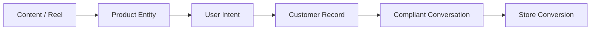

# 01. Product Philosophy, Objectives & Scope

## 1. Executive Summary

XINVORA is building a dedicated, first-party social commerce automation platform to replace third-party SaaS dependencies (such as ManyChat or HighLevel). 

The platform bridges:
- **XINVORA Instagram Professional Account**
- **XINVORA Facebook Page**
- **XINVORA Product Catalog & Collections**
- **Inbound Engagement (Comments, DMs, Stories, Mentions)**
- **Deterministic Automation Rules & Compliance Filters**
- **Contact Records & Omnichannel Conversation CRM**
- **Targeted Social Marketing Campaigns**
- **End-to-End Funnel & Conversion Analytics**

```text
Content → Comment/Interaction → Product → Automated Response → Product Page → Conversation → Customer
```

The system operates strictly on official Meta APIs, webhooks, and OAuth capabilities. It eliminates artificial SaaS pricing tiers (contact quotas or arbitrary monthly limits) while maintaining rigorous compliance with Meta's actual API rate limits and messaging windows.

---

## 2. Core Business Objective

Turn organic social media engagement on Instagram and Facebook into seamless product discovery, customer acquisition, and verified store revenue.

### Primary Commerce Flow Example:
1. XINVORA publishes an Instagram Reel showcasing a new party dress.
2. A viewer comments `"LINK"`, `"PRICE"`, or `"HOW MUCH"`.
3. Meta forwards the comment event to XINVORA's secure webhook endpoint.
4. The system validates the event and resolves the product mapped to that Reel.
5. The automation engine passes the message through the Meta Compliance Gate.
6. A single private reply is dispatched to the user's DM inbox with product details and a `"VIEW PRICE"` button.
7. Simultaneously, a randomized public reply is posted under the Reel (e.g., *"Sent to your DMs! 💌"*).
8. The button navigates the user directly to the XINVORA product checkout page.
9. Contact CRM records the interaction, product affinity, and link click.
10. If the customer responds, future qualifying conversations and permissible campaign updates (restocks, new drops) are unlocked within Meta's compliant windows.

---

## 3. Product Philosophy: Product-First Automation

Most chatbots are built around generic conversational trees. XINVORA's platform treats the **Product** as the foundational entity.



### Guiding Principles:
- **Content-to-Product Binding:** Every Reel, Post, or Story has direct or fallback association with specific product SKUs.
- **Intent Resolution:** Customer queries (price, size, stock, collection) resolve into structured product responses rather than open-ended bot replies.
- **Deterministic First, AI Second:** Reliable rule-based automation is the bedrock. AI is added later only as an enhancement for intent classification and product matching.
- **Strict Compliance as a Feature:** Anti-ban and policy compliance are built into the message pipeline—no message is dispatched without verifying 24-hour windows, 7-day private reply rules, and recipient eligibility.

---

## 4. Customer Journeys

```mermaid
journey
    title XINVORA Social Commerce Journeys
    section Journey A: Product Discovery
      Viewer watches Reel: 5: User
      Comments 'LINK': 5: User
      Receives Private Reply DM: 5: Automation
      Clicks 'VIEW PRICE' Button: 5: User
      Visits Product Page: 5: User
    section Journey B: Conversational Commerce
      User asks sizing/details: 4: User
      System verifies 24h window: 5: Compliance
      Sends size guide & recommendations: 5: Automation
      Escalates to Human if needed: 4: Support Agent
    section Journey C: Marketing Drops & Restocks
      Eligible opted-in audience identified: 5: Automation
      Meta-supported broadcast/update sent: 5: Automation
      User browses new collection: 5: User
```

---

## 5. Scope Definition: First Major Release vs. Deferred

### ✅ Scope for Initial Release (Milestone 1)

| Area | Features Included |
| :--- | :--- |
| **Account & Auth** | Meta OAuth 2.0, Instagram Professional connection, Facebook Page link, Token health monitor. |
| **Product Engine** | Product CRUD, SKU/Price/URL/Keywords, Manual & explicit Content-to-Product mapping. |
| **Content Sync** | Ingestion of Instagram Posts/Reels and Facebook Page Posts. |
| **Automation** | Global comment trigger, keyword/intent pool, private DM reply with CTA button, randomized public replies. |
| **Compliance** | Hard 24h window checks, 7-day private reply restriction (1 message max), audit logging. |
| **Reliability** | Webhook verification, PostgreSQL idempotent queue, rate-limiter, retry with exponential backoff. |
| **CRM & Inbox** | Unified Instagram/Facebook inbox, contact tagging, interaction timeline, Human Handoff toggle. |
| **Campaigns** | Broadcast/notification engine for eligible contacts (New Collections, Restocks). |
| **Analytics** | Comments received, automations triggered, DMs sent, CTA click tracking, handoff volume. |

### ❌ Features Intentionally Deferred (Future Phases)

- Public multi-tenant SaaS / billing subscription plans.
- Email marketing / SMS integration (purely Instagram/Facebook focused).
- Complex visual drag-and-drop canvas editor (standard structured forms used initially).
- Browser automation / password-based login bots (strictly prohibited).
- Full ERP inventory synchronization (added in Phase 11).
- Unrestricted AI auto-replies (AI used only as a classifier in Phase 12).

---

## 6. Success Criteria

A release is marked production-ready when:
1. Meta OAuth seamlessly connects both Instagram Professional and Facebook Pages.
2. Real-time webhooks ingest comments with zero loss under burst traffic.
3. Mapped products generate instant private replies with valid, trackable URLs within `< 2 seconds`.
4. Public comment replies cycle through random pools without back-to-back repetitions.
5. Ineligible messages (expired window, duplicate reply) are deterministically blocked and logged.
6. The human handoff switch immediately halts automated triggers for that conversation.
7. Zero reliance on scraping, unofficial endpoints, or browser emulation.
