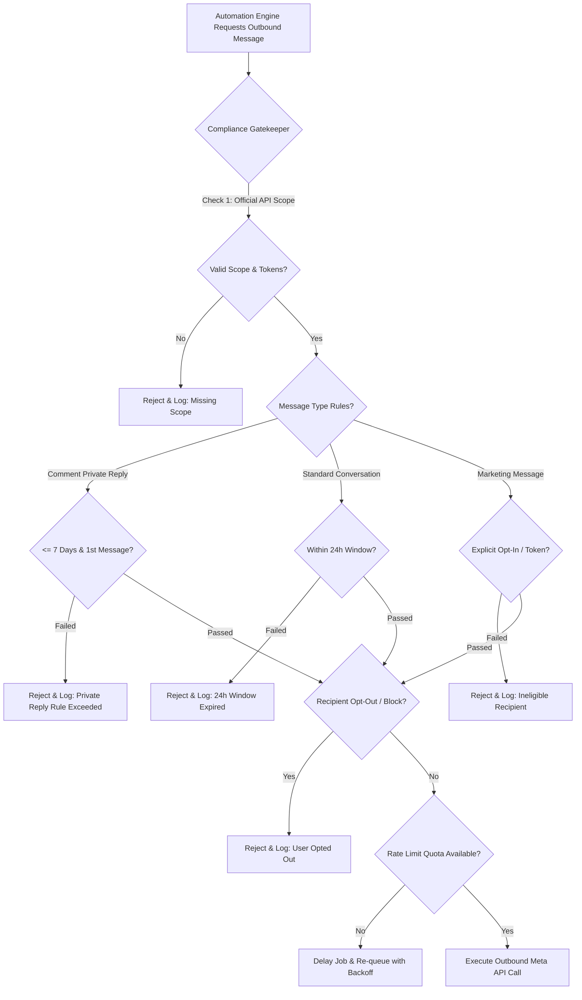

# 02. Meta Compliance & Anti-Ban Architecture

## 1. Compliance & Anti-Ban Philosophy

There is **no technical trick or engineering hack that can guarantee an account is 100% "ban-proof"**. 

Any automation claiming "unlimited ban-proof DMs" is operating on fragile unofficial endpoints or browser automation that Meta actively detects and sanctions.

### The XINVORA Risk-Minimization Standard:
$$\text{Official Meta APIs} + \text{Strict Policy Adherence} + \text{Dynamic Rate Throttling} + \text{Central Compliance Gate} = \textbf{Maximum Account Safety}$$



---

## 2. Official Meta API Constraints & Verified Rules

The system enforces three distinct messaging protocols defined by Meta's Official Developer Documentation:

### 1. Instagram Private Replies to Comments
- **Trigger:** Inbound comment on an Instagram Post, Reel, or Live.
- **Quota Limit:** Exactly **ONE** private reply per comment.
- **Time Window:** Must be dispatched within **7 days (168 hours)** of the comment creation timestamp.
- **Subsequent Messages:** Cannot send a 2nd message via the private reply endpoint. Further conversation requires the user to reply in DM (which opens the standard 24-hour window).

### 2. Standard Messaging (24-Hour Customer Care Window)
- **Trigger:** Direct Message (DM) initiated or replied to by the user.
- **Time Window:** Exactly **24 hours** from the user's latest message timestamp.
- **Allowed Content:** Conversational replies, product links, customer support answers, quick replies.
- **Expiry:** Once 24 hours elapse without a user response, no further standard messages can be sent.

### 3. Marketing & Broadcast Messages
- **Trigger:** Scheduled collection drops, restock alerts, brand promotions.
- **Eligibility:** Must use Meta-supported recurring notification tokens / opt-in mechanisms.
- **Restriction:** Arbitrary cold DMs to followers or commenters are strictly rejected by the compliance engine.

---

## 3. The Central Compliance Gatekeeper

All outbound messages across all channels (Instagram / Facebook) must pass through a single, non-bypassable service: `ComplianceGatekeeper.validate()`.

### Compliance Evaluation Matrix

| Parameter | Comment Private Reply | Standard DM | Marketing Broadcast |
| :--- | :--- | :--- | :--- |
| **API Endpoint** | `/messages` (recipient: `comment_id`) | `/messages` (recipient: `ig_id` / `psid`) | Meta Notification API |
| **Window** | $\le 7$ days from comment | $\le 24$ hours from last user msg | Valid Opt-in Token |
| **Max Auto Replies** | Exactly 1 | Unlimited within 24h | Per Meta frequency cap |
| **Requires User Consent** | Organic comment | Inbound DM interaction | Explicit notification opt-in |
| **Failure Mode** | Drop & log `POLICY_VIOLATION` | Drop & flag for Human Review | Mark campaign as `SKIPPED` |

---

## 4. Rate Limiting & Dynamic Throttling

Meta enforces tier-based and call-count rate limits based on rolling app usage and account age:

- **No Artificial Application Quotas:** The software does not cap usage at arbitrary numbers (e.g., ManyChat tiers).
- **Dynamic API Header Inspection:** Every Meta API response header (`X-App-Usage`, `X-Business-Use-Case-Usage`) is parsed in real time.
- **Proactive Burst Throttling:** Outbound messages are dispatched with randomized jitter ($1.5s - 4.5s$) and strict concurrency limits per connected account to prevent triggering burst spam filters.
- **Exponential Backoff:** Rate-limit responses (`OAuthException` Error 4, 17, 32, 613) automatically back off processing exponentially ($15s \to 60s \to 300s$).

---

## 5. Audit Logging Schema: `compliance_decisions`

Every outbound decision (whether approved, rejected, or throttled) is written to an immutable audit log:

```sql
CREATE TABLE compliance_decisions (
    id UUID PRIMARY KEY DEFAULT gen_random_uuid(),
    account_id UUID REFERENCES accounts(id),
    channel VARCHAR(20) NOT NULL, -- 'instagram' | 'facebook'
    recipient_id VARCHAR(100) NOT NULL,
    trigger_type VARCHAR(50) NOT NULL, -- 'comment_reply' | 'dm_response' | 'campaign'
    message_payload JSONB NOT NULL,
    status VARCHAR(20) NOT NULL, -- 'ALLOWED' | 'BLOCKED' | 'THROTTLED'
    rejection_reason VARCHAR(255), -- 'EXPIRED_24H_WINDOW', 'DUPLICATE_PRIVATE_REPLY', etc.
    meta_response_code INT,
    created_at TIMESTAMPTZ DEFAULT NOW()
);
```

---

## 6. The 20 Non-Negotiable Rules

1. **Official Meta APIs only.** Never reverse engineer private Instagram endpoints.
2. **Never store user passwords.** Authenticate exclusively via OAuth 2.0.
3. **No browser automation.** Never use Selenium, Puppeteer, or Playwright to mimic user accounts.
4. **No cookie/session hijacking.** Always use short/long-lived Graph API tokens.
5. **No scraping of private user data.** Only consume data provided through authorized webhooks.
6. **No API rate-limit circumvention.** Never rotate tokens or IP proxies to bypass limits.
7. **No multi-app proxying.** Do not register fake Meta developer apps to multiply quotas.
8. **No arbitrary follower mass-DMs.** Followers cannot be cold-messaged without valid triggers.
9. **Mandatory pre-flight eligibility checks.** Every outbound payload is verified before dispatch.
10. **Strict adherence to the 24-hour customer window.**
11. **Strict adherence to the 7-day single private-reply limit.**
12. **Automatic handling of user opt-outs / stop keywords.**
13. **Full audit logging for every message attempt.**
14. **Safe queuing with exponential backoff on retries.**
15. **Secure server-side storage for secrets and OAuth tokens.**
16. **Dry-run simulation mode required before activating new automations.**
17. **Content must be directly relevant to the user's explicit interaction.**
18. **Continuous monitoring and updates based on Meta Changelogs.**
19. **Immediate hard-stop and alert on persistent permission errors.**
20. **Never market the software as a "ban-proof spam tool".**
