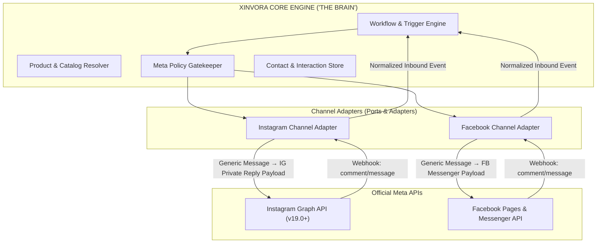
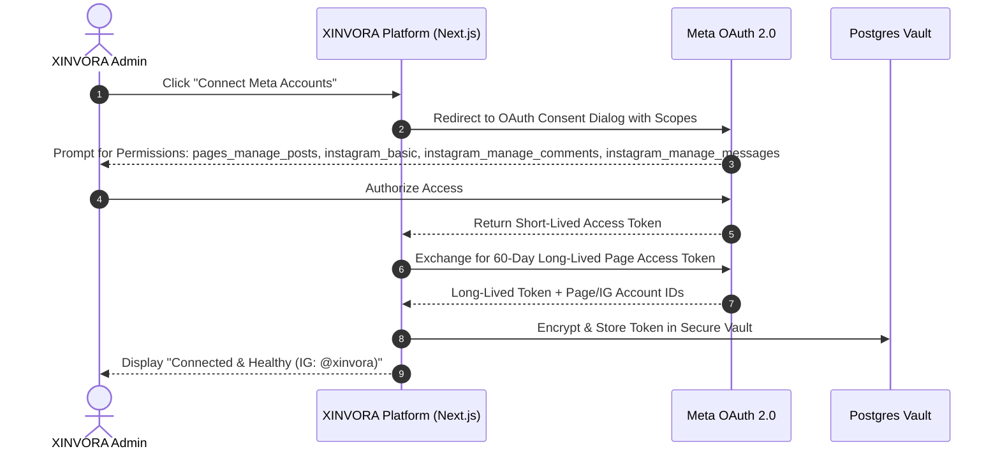

# 03. System Architecture & Technology Stack

## 1. Architecture Paradigm: "Single Brain, Multiple Channels"

A core design flaw in legacy social tools is tightly coupling business logic to Instagram or Facebook API endpoints. 

XINVORA uses a **Hexagonal / Ports & Adapters Architecture**:
- The **Automation Core ("Brain")** is completely network-agnostic.
- The **Channel Adapters** translate generic intent commands into platform-specific payload structures.



---

## 2. Channel Adapter Interfaces

### Normalized Inbound Event Format:
Regardless of whether an event originated from an Instagram Reel comment or a Facebook Page Post comment, it is normalized before reaching the engine:

```typescript
interface NormalizedInboundEvent {
  eventId: string;
  channel: 'instagram' | 'facebook';
  eventType: 'comment' | 'message' | 'story_mention' | 'live_comment';
  accountId: string;
  actor: {
    platformUserId: string;
    username?: string;
    fullName?: string;
  };
  content: {
    contentId: string; // Reel ID, Post ID, or Thread ID
    contentType: 'reel' | 'post' | 'story' | 'dm';
    text: string;
    commentId?: string;
    parentId?: string;
  };
  timestamp: string; // ISO-8601
}
```

### Channel Adapter Contract:
```typescript
interface ChannelAdapter {
  sendCommentPrivateReply(commentId: string, message: string, button?: CTAButton): Promise<OutboundResult>;
  sendPublicCommentReply(commentId: string, message: string): Promise<OutboundResult>;
  sendDirectMessage(recipientId: string, message: string, quickReplies?: string[]): Promise<OutboundResult>;
  verifyWebhookSignature(payload: string, signature: string): boolean;
}
```

---

## 3. Technology Stack Specification

| Tier | Technology | Rationale & Selection Criteria |
| :--- | :--- | :--- |
| **Frontend UI** | **Next.js 14+ (App Router)** | Modern React server components, fast routing, SSR/SSG, premium dashboard styling with custom design tokens. |
| **Backend & APIs** | **Next.js API Routes / Server Actions** | Unified TypeScript codebase, native edge/serverless compatibility, zero extra API server maintenance for MVP. |
| **Database** | **PostgreSQL (via Supabase)** | High-performance relational schema, built-in Row-Level Security (RLS), real-time capabilities, ACID transactions. |
| **ORM / Data Client** | **Prisma / Kysely / Supabase JS** | Fully type-safe database queries, automated migration management, zero schema drift. |
| **Background Queue** | **PostgreSQL Job Queue (pg-boss / Supabase Queues)** | Reliable queueing with transactional consistency; easily upgraded to Redis/BullMQ under high load. |
| **Deployment / Hosting** | **Vercel** | Seamless Next.js deployment, edge routing, automated CI/CD, global CDN distribution. |
| **Auth & Identity** | **Meta OAuth 2.0 + Supabase Auth** | Meta OAuth for social permissions; Supabase Auth for internal team admin access. |

---

## 4. Account Architecture & Token Flow



### Critical Token Storage Requirements:
1. **Never Store Passwords:** Instagram / Facebook credentials are never collected or stored.
2. **Encrypted at Rest:** OAuth tokens are AES-256 encrypted before writing to `channels` table.
3. **Automated Token Refresh:** A scheduled cron job checks token expiry 14 days in advance and refreshes long-lived tokens automatically.

---

## 5. Security & Boundary Architecture

```text
[ Browser / Client ]
       │  (No Meta Secrets, No App Secret, No Direct Database Access)
       ▼
[ Next.js Edge / Server Functions ]
       │  - Validates Admin Session
       │  - Decrypts Meta Access Tokens
       │  - Verifies Webhook HMAC-SHA256 Signatures (X-Hub-Signature-256)
       ▼
[ PostgreSQL / Supabase Vault ]
       │  - Row-Level Security (RLS)
       │  - Transactional Isolation
       ▼
[ Outbound Meta Graph API ]
```

### Security Checklists:
- `X-Hub-Signature-256` verification is enforced on all webhook requests before any event parsing occurs.
- Admin APIs require JWT session authentication.
- Outbound API requests use TLS 1.3 with strict timeout policies.
