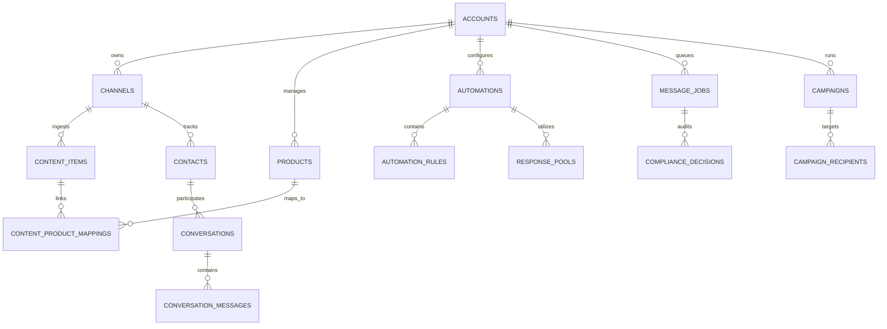

# 04. Database Schema & Entity Relationships

## 1. Entity Relationship Overview

The database design provides full relational integrity for accounts, content mappings, products, automations, conversations, queue jobs, and compliance logs.



---

## 2. Core Table Schemas & DDL

### 2.1 Accounts & Channels
```sql
-- Main workspace / tenant container
CREATE TABLE accounts (
    id UUID PRIMARY KEY DEFAULT gen_random_uuid(),
    name VARCHAR(100) NOT NULL,
    status VARCHAR(20) DEFAULT 'ACTIVE', -- 'ACTIVE', 'PAUSED', 'SUSPENDED'
    created_at TIMESTAMPTZ DEFAULT NOW(),
    updated_at TIMESTAMPTZ DEFAULT NOW()
);

-- Connected Social Channels (IG & FB)
CREATE TABLE channels (
    id UUID PRIMARY KEY DEFAULT gen_random_uuid(),
    account_id UUID NOT NULL REFERENCES accounts(id) ON DELETE CASCADE,
    channel_type VARCHAR(20) NOT NULL, -- 'INSTAGRAM' | 'FACEBOOK'
    platform_account_id VARCHAR(100) NOT NULL, -- Meta IG Business ID or FB Page ID
    platform_username VARCHAR(100),
    encrypted_access_token TEXT NOT NULL,
    token_expires_at TIMESTAMPTZ,
    status VARCHAR(20) DEFAULT 'CONNECTED', -- 'CONNECTED', 'DISCONNECTED', 'EXPIRED'
    created_at TIMESTAMPTZ DEFAULT NOW(),
    updated_at TIMESTAMPTZ DEFAULT NOW(),
    UNIQUE(channel_type, platform_account_id)
);
```

---

### 2.2 Products & Content Mapping
```sql
-- Product Catalog
CREATE TABLE products (
    id UUID PRIMARY KEY DEFAULT gen_random_uuid(),
    account_id UUID NOT NULL REFERENCES accounts(id) ON DELETE CASCADE,
    product_code VARCHAR(50) NOT NULL, -- e.g. 'DRESS-001'
    title VARCHAR(255) NOT NULL,
    category VARCHAR(100),
    price NUMERIC(10, 2) NOT NULL,
    currency VARCHAR(10) DEFAULT 'NPR',
    product_url TEXT NOT NULL,
    image_url TEXT,
    description TEXT,
    available_sizes TEXT[], -- e.g. ['S', 'M', 'L', 'XL']
    keywords TEXT[] DEFAULT '{}', -- e.g. ['black dress', 'party dress', 'cocktail']
    inventory_status VARCHAR(20) DEFAULT 'IN_STOCK', -- 'IN_STOCK', 'LOW_STOCK', 'OUT_OF_STOCK'
    is_active BOOLEAN DEFAULT TRUE,
    created_at TIMESTAMPTZ DEFAULT NOW(),
    updated_at TIMESTAMPTZ DEFAULT NOW(),
    UNIQUE(account_id, product_code)
);

-- Synced Social Content (Posts, Reels)
CREATE TABLE content_items (
    id UUID PRIMARY KEY DEFAULT gen_random_uuid(),
    channel_id UUID NOT NULL REFERENCES channels(id) ON DELETE CASCADE,
    platform_content_id VARCHAR(100) NOT NULL, -- Meta Post ID / Reel Media ID
    content_type VARCHAR(20) NOT NULL, -- 'POST', 'REEL', 'STORY', 'LIVE'
    permalink TEXT,
    caption TEXT,
    media_url TEXT,
    posted_at TIMESTAMPTZ,
    created_at TIMESTAMPTZ DEFAULT NOW(),
    UNIQUE(channel_id, platform_content_id)
);

-- Explicit Content-to-Product Binding
CREATE TABLE content_product_mappings (
    id UUID PRIMARY KEY DEFAULT gen_random_uuid(),
    content_item_id UUID NOT NULL REFERENCES content_items(id) ON DELETE CASCADE,
    product_id UUID NOT NULL REFERENCES products(id) ON DELETE CASCADE,
    is_primary BOOLEAN DEFAULT TRUE,
    created_at TIMESTAMPTZ DEFAULT NOW(),
    UNIQUE(content_item_id, product_id)
);
```

---

### 2.3 Automations & Response Pools
```sql
-- Automations
CREATE TABLE automations (
    id UUID PRIMARY KEY DEFAULT gen_random_uuid(),
    account_id UUID NOT NULL REFERENCES accounts(id) ON DELETE CASCADE,
    name VARCHAR(150) NOT NULL,
    is_global BOOLEAN DEFAULT FALSE, -- Applies to all content if true
    trigger_type VARCHAR(50) NOT NULL, -- 'COMMENT', 'DM', 'STORY_MENTION'
    status VARCHAR(20) DEFAULT 'ACTIVE', -- 'ACTIVE', 'PAUSED', 'DRAFT'
    created_at TIMESTAMPTZ DEFAULT NOW(),
    updated_at TIMESTAMPTZ DEFAULT NOW()
);

-- Randomized Public Response Pools
CREATE TABLE response_pools (
    id UUID PRIMARY KEY DEFAULT gen_random_uuid(),
    automation_id UUID REFERENCES automations(id) ON DELETE CASCADE,
    name VARCHAR(100) NOT NULL,
    responses TEXT[] NOT NULL, -- e.g. ['Check your DMs! 💌', 'Details sent to your inbox! ✨']
    selection_strategy VARCHAR(30) DEFAULT 'RANDOM_AVOID_REPEAT',
    last_chosen_index INT DEFAULT -1,
    created_at TIMESTAMPTZ DEFAULT NOW()
);
```

---

### 2.4 Contacts & Omnichannel Conversations (CRM)
```sql
-- Contacts
CREATE TABLE contacts (
    id UUID PRIMARY KEY DEFAULT gen_random_uuid(),
    channel_id UUID NOT NULL REFERENCES channels(id) ON DELETE CASCADE,
    platform_user_id VARCHAR(100) NOT NULL, -- IG-Scoped ID or FB PSID
    username VARCHAR(100),
    full_name VARCHAR(150),
    tags TEXT[] DEFAULT '{}',
    is_opted_out BOOLEAN DEFAULT FALSE,
    last_interaction_at TIMESTAMPTZ DEFAULT NOW(),
    created_at TIMESTAMPTZ DEFAULT NOW(),
    UNIQUE(channel_id, platform_user_id)
);

-- Conversations
CREATE TABLE conversations (
    id UUID PRIMARY KEY DEFAULT gen_random_uuid(),
    contact_id UUID NOT NULL REFERENCES contacts(id) ON DELETE CASCADE,
    status VARCHAR(20) DEFAULT 'AUTOMATED', -- 'AUTOMATED', 'NEEDS_ATTENTION', 'HUMAN_HANDLED', 'CLOSED'
    last_message_at TIMESTAMPTZ DEFAULT NOW(),
    active_product_id UUID REFERENCES products(id),
    created_at TIMESTAMPTZ DEFAULT NOW()
);

-- Messages Log
CREATE TABLE conversation_messages (
    id UUID PRIMARY KEY DEFAULT gen_random_uuid(),
    conversation_id UUID NOT NULL REFERENCES conversations(id) ON DELETE CASCADE,
    direction VARCHAR(10) NOT NULL, -- 'INBOUND' | 'OUTBOUND'
    sender_type VARCHAR(20) NOT NULL, -- 'USER', 'BOT', 'HUMAN_AGENT'
    message_type VARCHAR(30) NOT NULL, -- 'PRIVATE_REPLY', 'DIRECT_MESSAGE', 'PUBLIC_COMMENT'
    text TEXT,
    payload JSONB,
    created_at TIMESTAMPTZ DEFAULT NOW()
);
```

---

### 2.5 Reliability, Queues & Audit Logging
```sql
-- Outbound Message Queue
CREATE TABLE message_jobs (
    id UUID PRIMARY KEY DEFAULT gen_random_uuid(),
    account_id UUID NOT NULL REFERENCES accounts(id) ON DELETE CASCADE,
    channel_id UUID NOT NULL REFERENCES channels(id) ON DELETE CASCADE,
    recipient_id VARCHAR(100) NOT NULL,
    job_type VARCHAR(30) NOT NULL, -- 'COMMENT_PRIVATE_REPLY', 'PUBLIC_REPLY', 'DM_SEND'
    payload JSONB NOT NULL,
    status VARCHAR(20) DEFAULT 'PENDING', -- 'PENDING', 'PROCESSING', 'COMPLETED', 'FAILED', 'BLOCKED'
    retry_count INT DEFAULT 0,
    max_retries INT DEFAULT 3,
    scheduled_for TIMESTAMPTZ DEFAULT NOW(),
    processed_at TIMESTAMPTZ,
    error_log TEXT,
    idempotency_key VARCHAR(255) UNIQUE NOT NULL,
    created_at TIMESTAMPTZ DEFAULT NOW()
);

-- Compliance Decisions Audit Table
CREATE TABLE compliance_decisions (
    id UUID PRIMARY KEY DEFAULT gen_random_uuid(),
    message_job_id UUID REFERENCES message_jobs(id),
    account_id UUID NOT NULL REFERENCES accounts(id),
    recipient_id VARCHAR(100) NOT NULL,
    evaluation_result VARCHAR(20) NOT NULL, -- 'APPROVED', 'REJECTED', 'THROTTLED'
    reason VARCHAR(100), -- 'PASSED_POLICY', 'EXPIRED_24H_WINDOW', 'DUPLICATE_REPLY'
    metadata JSONB,
    created_at TIMESTAMPTZ DEFAULT NOW()
);
```
