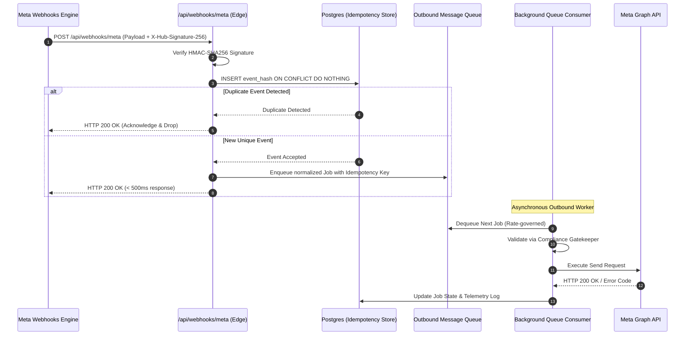

# 05. Event Ingestion, Queues & Reliability Engineering

## 1. Webhook Ingestion & Processing Pipeline

The ingestion pipeline handles unpredictable burst traffic (e.g. viral Reels receiving thousands of comments per hour) without dropping events or hitting rate limits.



---

## 2. Idempotency & Duplicate Protection Strategy

Meta's webhook infrastructure follows **at-least-once delivery**, which means duplicate events are guaranteed to arrive periodically.

### Idempotency Key Formulation:
To prevent duplicate DMs or double public replies, an idempotency key is computed for every inbound action:

$$\text{IdempotencyKey} = \text{SHA256}(\text{channel} + \text{event\_type} + \text{platform\_content\_id} + \text{platform\_user\_id} + \text{action\_type})$$

### Ingestion Logic:
```typescript
export async function processInboundWebhook(rawEvent: RawMetaEvent) {
  const idempotencyKey = generateHash([
    rawEvent.channel,
    rawEvent.type,
    rawEvent.contentId,
    rawEvent.commentId || rawEvent.messageId,
    'OUTBOUND_PRIVATE_REPLY'
  ]);

  const { data: existing, error } = await supabase
    .from('message_jobs')
    .insert({
      idempotency_key: idempotencyKey,
      status: 'PENDING',
      payload: rawEvent
    })
    .select('id')
    .single();

  if (error && error.code === '23505') { // Postgres Unique Constraint Violation
    console.log(`[Idempotency] Duplicate event skipped: ${idempotencyKey}`);
    return { status: 'SKIPPED_DUPLICATE' };
  }

  return { status: 'ENQUEUED', jobId: existing.id };
}
```

---

## 3. Queue & Worker Architecture

1. **Transactional Queue:** Jobs reside in `message_jobs` in PostgreSQL.
2. **Deterministic State Transition:**
   $$\text{PENDING} \longrightarrow \text{PROCESSING} \longrightarrow \begin{cases} \text{COMPLETED} \\ \text{FAILED} \\ \text{BLOCKED\_BY\_POLICY} \end{cases}$$
3. **Burst Smoothing (Leaky Bucket / Token Bucket):** Maximum dispatch rate per connected channel: **10 messages / 5 seconds** with random jitter (50ms - 200ms) to ensure smooth traffic distribution.

---

## 4. Error Handling & Retry Matrix

| Meta Error Code | Error Classification | Action Taken | Backoff Strategy |
| :--- | :--- | :--- | :--- |
| **`HTTP 200 / Success`** | Success | Mark job `COMPLETED`. Log telemetry. | None |
| **`Code 4, 17, 32 (Rate Limit)`** | Transient / Throttled | Mark job `RETRY`. Backoff queue for account. | $30\text{s} \to 120\text{s} \to 600\text{s}$ |
| **`Code 500 / Network Timeout`** | Transient Server Error | Retry up to 3 times with exponential backoff. | $5\text{s} \to 25\text{s} \to 125\text{s}$ |
| **`Code 190 (Invalid / Expired Token)`** | Critical Auth Error | Mark job `FAILED`. Set channel status `EXPIRED`. Dispatch Admin Alert. | Hard Stop (No retry) |
| **`Code 100 / Subcode 2018001`** | Policy: Private Reply Expired | Mark job `BLOCKED`. Log compliance audit record. | Hard Stop (No retry) |
| **`Code 10 / User Opted Out / Blocked`** | Recipient Ineligible | Update contact `is_opted_out = true`. Mark job `BLOCKED`. | Hard Stop (No retry) |

---

## 5. Circuit Breakers

If an account encounters $> 5$ consecutive authentication or policy rejections within 5 minutes:
- The channel is placed in **Circuit-Open (PAUSED)** mode.
- Outbound jobs for that channel are temporarily held.
- An alert is sent to the XINVORA dashboard to prevent repeated API strikes.
