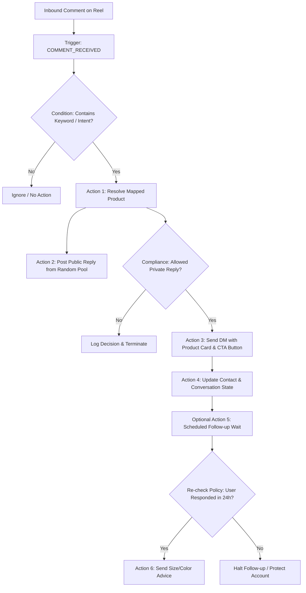

# 06. Automation Engine, Rules & Workflows

## 1. The Core Automation Pipeline

The automation engine executes on a composable graph structure:

$$\textbf{Trigger} \longrightarrow \textbf{Conditions (Filters)} \longrightarrow \textbf{Actions} \longrightarrow \textbf{Wait / Follow-up} \longrightarrow \textbf{Compliance Check} \longrightarrow \textbf{Next Action}$$



---

## 2. Intent & Keyword Classification

The engine supports both exact keyword sets and normalized intent phrases.

### Intent Resolution Map

```text
Intent: PRODUCT_INQUIRY
  ├── Keywords: 'link', 'price', 'buy', 'cost', 'where', 'shop', 'order'
  ├── Nepali / Romanized: 'kati ho', 'kaha pauncha', 'pathaidinu na', 'link dinu'
  └── Action: Send Product Card + "VIEW PRICE" button

Intent: SIZING_INQUIRY
  ├── Keywords: 'size', 'sizes', 'small', 'medium', 'large', 'plus size', 'fit'
  └── Action: Send Size Guide & Measurements Card

Intent: AVAILABILITY_INQUIRY
  ├── Keywords: 'available', 'stock', 'in stock', 'out of stock', 'cha ki chaina'
  └── Action: Send Stock Status + "SHOP NOW" button

Intent: HUMAN_SUPPORT_ESCALATION
  ├── Keywords: 'human', 'agent', 'support', 'wrong order', 'refund', 'complaint', 'exchange'
  └── Action: Set conversation to 'NEEDS_ATTENTION' & pause automated replies
```

---

## 3. Randomized Public Reply System

To maintain brand authenticity and prevent public comment threads from looking like spam bots, public replies are drawn from an anti-repetition pool.

```text
Pool: "General Product Inquiry"
  [1] "Sent you the details! Check your DMs 💌"
  [2] "Just dropped the link in your inbox! ✨"
  [3] "Check your messages for the product link! 🛍️"
  [4] "Sent! Let us know if you need help with sizing 💕"
  [5] "Check your DM for full pricing & details! 👗"
```

### Selection Algorithm:
- **Strategy:** `RANDOM_AVOID_REPEAT`
- **Logic:** Excludes the previous $N$ chosen responses ($N \ge 2$) from the pool before generating a pseudo-random index, preventing identical replies on consecutive comments.

---

## 4. Message Payload Formats

### Instagram Private Reply Payload (Meta Graph API)
```json
{
  "recipient": {
    "comment_id": "179238491823901"
  },
  "message": {
    "attachment": {
      "type": "template",
      "payload": {
        "template_type": "generic",
        "elements": [
          {
            "title": "Black Velvet Party Dress",
            "subtitle": "NPR 3,499 | Sizes: S, M, L",
            "image_url": "https://your-store.com/cdn/dress-001.jpg",
            "buttons": [
              {
                "type": "web_url",
                "url": "https://your-store.com/products/black-velvet-dress?utm_source=instagram&utm_medium=auto_dm",
                "title": "VIEW PRICE"
              }
            ]
          }
        ]
      }
    }
  }
}
```

---

## 5. Built-in Test Simulator ("Dry-Run Mode")

Before enabling an automation on live social channels, operators can execute end-to-end dry runs in the admin UI:

```text
┌────────────────────────────────────────────────────────┐
│               AUTOMATION TEST SIMULATOR                │
├────────────────────────────────────────────────────────┤
│ Input Simulation:                                      │
│ • Channel: Instagram (@xinvora)                        │
│ • Post: Reel #42 (Black Velvet Dress)                  │
│ • Simulated User Comment: "link please kati ho"        │
├────────────────────────────────────────────────────────┤
│ Execution Results:                                     │
│ [✓] Matched Intent: PRODUCT_INQUIRY                    │
│ [✓] Resolved Product: DRESS-001 (NPR 3,499)           │
│ [✓] Public Reply Chosen: "Sent you the details! 💌"    │
│ [✓] Compliance Gate: PASSED (7-day rule valid)         │
│ [✓] Rendered Payload: Card with "VIEW PRICE" button    │
│ [✓] Audit Record Created (Test Sandbox ID #941)        │
└────────────────────────────────────────────────────────┘
```
