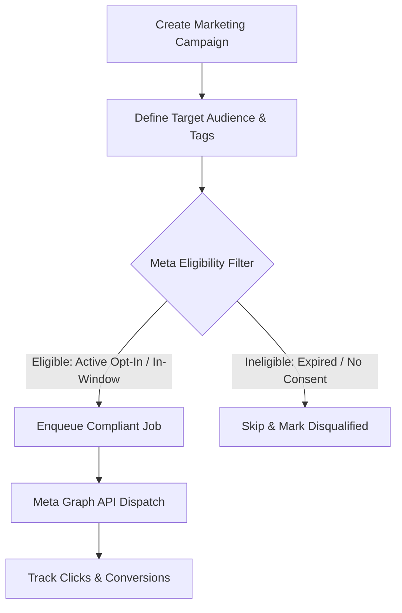
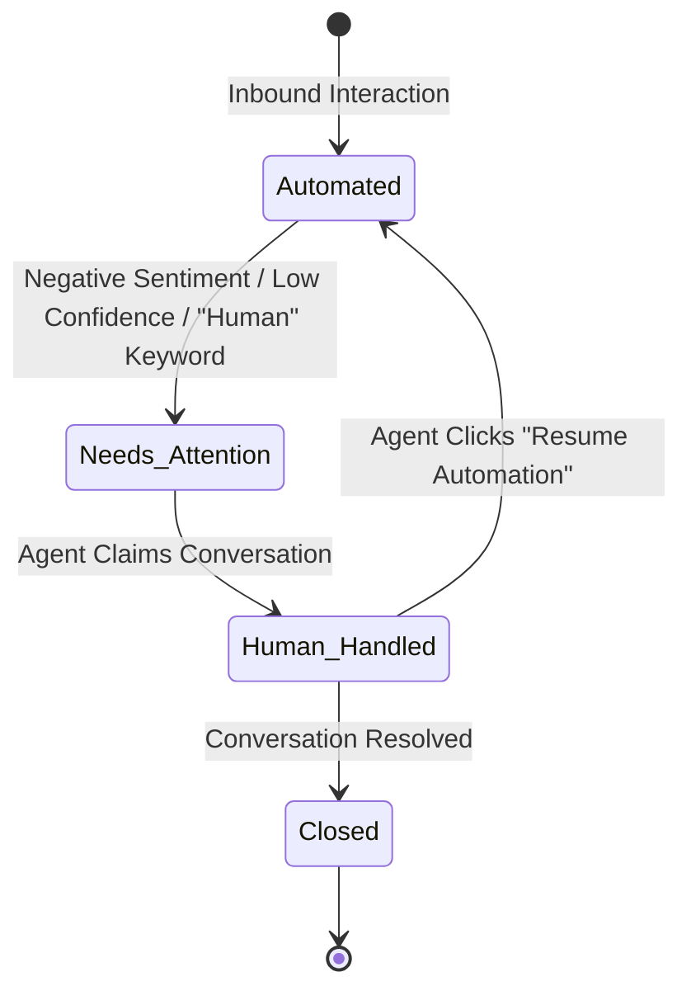

# 07. Marketing Campaigns, CRM & Human Handoff

## 1. Social Commerce Marketing Engine

Unlike standard email or SMS marketing, Instagram and Facebook marketing automation is bound by strict Meta privacy and messaging policies.

### Campaign Types Supported:
1. **New Collection Drops:** Announcing seasonal lines to users who previously engaged or opted in.
2. **Product Restock Alerts:** Messaging users who explicitly inquired about an out-of-stock item when inventory is replenished.
3. **VIP Early Access:** Delivering early purchase links to high-intent customer segments.



---

## 2. Audience Segmentation & Eligibility Matrix

| Audience Segment | Definition | Permitted Messaging Mechanism |
| :--- | :--- | :--- |
| **Active Inquirers** | Interacted via DM in last 24h | Standard 24h Conversational DM |
| **Recent Commenters** | Commented on Reel/Post within 7 days | Single Private Reply per Comment |
| **Notification Subscribers** | Users who opted into recurring alerts | Meta Recurring Notifications API |
| **General Followers** | Follows the account (no recent interaction) | **PROHIBITED** (Cannot cold-DM) |

> [!IMPORTANT]
> A contact's presence in the database does **NOT** grant permission to send unsolicited promotional DMs. Every campaign pass verifies active compliance eligibility before queueing.

---

## 3. Social CRM & Contact Profile Model

Each contact maintains an aggregated timeline of cross-platform touchpoints:

```text
┌───────────────────────────────────────────────────────────┐
│ CONTACT PROFILE: @anita_shrestha                          │
├───────────────────────────────────────────────────────────┤
│ Platform: Instagram (IG-Scoped ID: 17841400238491)        │
│ Total Interactions: 6                                     │
│ Status: Active Inquirer (24h window active: 4h 12m left)  │
│                                                           │
│ Tags:                                                     │
│ [DRESS_LOVER] [SIZE_M] [VALENTINES_DROP] [HIGH_INTENT]    │
│                                                           │
│ Interaction Timeline:                                     │
│ • 2026-08-26 14:10 - Commented on Reel #42: "link please" │
│ • 2026-08-26 14:10 - Automated Private Reply Sent (DRESS)  │
│ • 2026-08-26 14:12 - Clicked "VIEW PRICE" (Product Page)  │
│ • 2026-08-26 14:15 - Replied in DM: "Do you have red?"    │
│ • 2026-08-26 14:15 - Human Handoff Activated               │
└───────────────────────────────────────────────────────────┘
```

---

## 4. Unified Conversations Inbox & Live Chat

The dashboard provides a unified real-time inbox for Instagram and Facebook conversations:

```text
┌─────────────────────────┬────────────────────────────────────────────┐
│ CONVERSATION LIST       │ ACTIVE CHAT: @anita_shrestha               │
├─────────────────────────┼────────────────────────────────────────────┤
│ [!] @anita_shrestha     │ [Bot]: Here is the Black Velvet Dress.     │
│     Needs Attention 14m │        [ VIEW PRICE ]                      │
│                         │                                            │
│ [✓] @priya_k            │ [User]: Do you have this in red color?     │
│     Automated 1h ago    │                                            │
│                         │ ────────────────────────────────────────── │
│ [✓] @sneha_m            │ [!] Automation PAUSED - Human Mode Active  │
│     Completed 3h ago    │                                            │
│                         │ [ Human Agent Input Box...               ] │
│                         │ [ Send Message ]  [ Resume Automation ]    │
└─────────────────────────┴────────────────────────────────────────────┘
```

---

## 5. Human Handoff Architecture

When automated intent confidence is low or a customer expresses complex support needs, the system triggers an instant handoff:



### Handoff Triggers:
1. Explicit user request (*"talk to human"*, *"real person please"*).
2. Intent classification confidence falls below $70\%$.
3. Order issues, returns, payment disputes, or customization inquiries.
4. Consecutive unrecognized inputs ($> 2$ fallback triggers).
