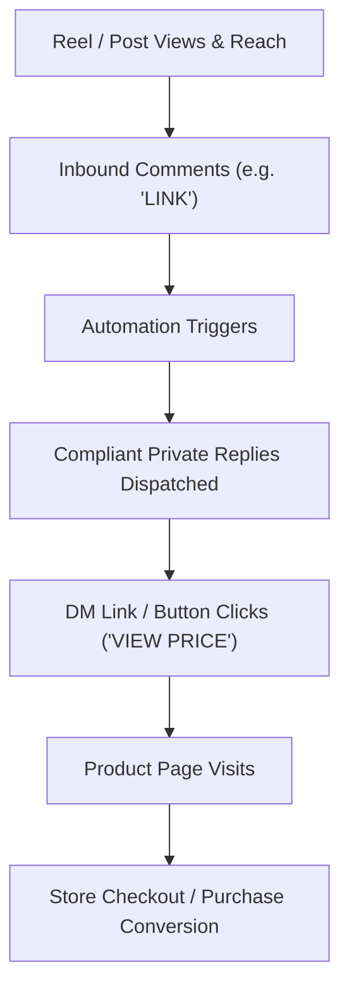

# 08. Analytics, Telemetry & Admin Dashboard

## 1. Social Commerce Conversion Funnel

The platform measures the full lifecycle from social engagement to store checkout:



---

## 2. Core Telemetry Event Taxonomy

Every critical interaction emits a structured telemetry event stored in `analytics_events`:

| Event Name | Trigger Context | Associated Dimensions |
| :--- | :--- | :--- |
| `COMMENT_RECEIVED` | Inbound webhook parsed | `channel`, `content_id`, `actor_id` |
| `INTENT_RESOLVED` | Rule matches keyword | `intent_type`, `matched_keyword`, `confidence` |
| `COMPLIANCE_EVALUATED` | Compliance gatekeeper check | `result (ALLOWED/BLOCKED)`, `rule_checked` |
| `PRIVATE_REPLY_SENT` | Meta Graph API response 200 | `product_id`, `comment_id`, `latency_ms` |
| `PUBLIC_REPLY_SENT` | Public comment published | `response_pool_id`, `template_index` |
| `CTA_BUTTON_CLICKED` | Redirect URL accessed | `product_id`, `contact_id`, `utm_campaign` |
| `HUMAN_HANDOFF_TRIGGERED` | Automation paused | `reason`, `conversation_id` |
| `CAMPAIGN_DISPATCHED` | Broadcast message sent | `campaign_id`, `eligible_recipient_count` |

---

## 3. Admin Dashboard UI Specification

The dashboard is built with a modern, high-contrast dark theme, glassmorphism cards, and real-time state updates.

### 3.1 Main Overview Metrics
- **Comments Processed Today:** Total inbound comments ingested.
- **Automation Success Rate:** Percentage of eligible comments that received instant DMs ($>99\%$).
- **Total Button Clicks:** Number of users who clicked from Instagram DMs into the website.
- **Active Handoffs:** Conversations currently waiting for a human agent.
- **Top Converting Reels:** Ranked list of Reels by DM click-through volume.

```text
┌──────────────────────────────────────────────────────────────────────────┐
│  X I N V O R A   S O C I A L   C O M M E R C E   D A S H B O A R D       │
├─────────────────┬─────────────────┬──────────────────┬───────────────────┤
│ Comments Today  │ Auto DMs Sent   │ Store Clicks     │ Needs Human       │
│ 1,420 (+18%)    │ 1,394 (98.2%)   │ 912 (65.4% CTR)  │ 4 Active          │
├─────────────────┴─────────────────┴──────────────────┴───────────────────┤
│ REAL-TIME ACTIVITY STREAM                                                │
│ • [14:22:01] IG @anita_s commented "price" on Reel #42 → DM Sent (DRESS)│
│ • [14:21:40] FB @ram_k commented "link" on Post #12 → DM Sent (TEE)     │
│ • [14:20:15] IG @maya_9 clicked "VIEW PRICE" → Navigated to Product Page │
└──────────────────────────────────────────────────────────────────────────┘
```

---

## 4. Key Management Views

```text
/admin
  ├── /overview         (Executive metrics, funnel charts, real-time feed)
  ├── /automations      (Create/edit rules, response pools, dry-run simulator)
  ├── /products         (Product catalog, SKUs, pricing, keywords, direct URLs)
  ├── /content-map      (Sync Instagram Reels & bind them to specific products)
  ├── /inbox            (Unified omnichannel inbox, human takeover toggle)
  ├── /campaigns        (Collection drops, restock alerts, audience eligibility)
  ├── /logs & audit     (Webhook event logs, API telemetry, compliance decisions)
  └── /settings         (Meta OAuth credentials, webhook verification keys, token status)
```

---

## 5. UTM Tracking & Attribution

All product links generated by the automation engine append deterministic tracking parameters:

```text
https://<your-store-domain>/products/black-dress?utm_source=instagram&utm_medium=auto_dm&utm_campaign=reel_42&utm_content=view_price_btn
```

This allows XINVORA's Google Analytics / Shopify / custom store backend to attribute 100% of social automation revenue back to individual Reels and posts.
