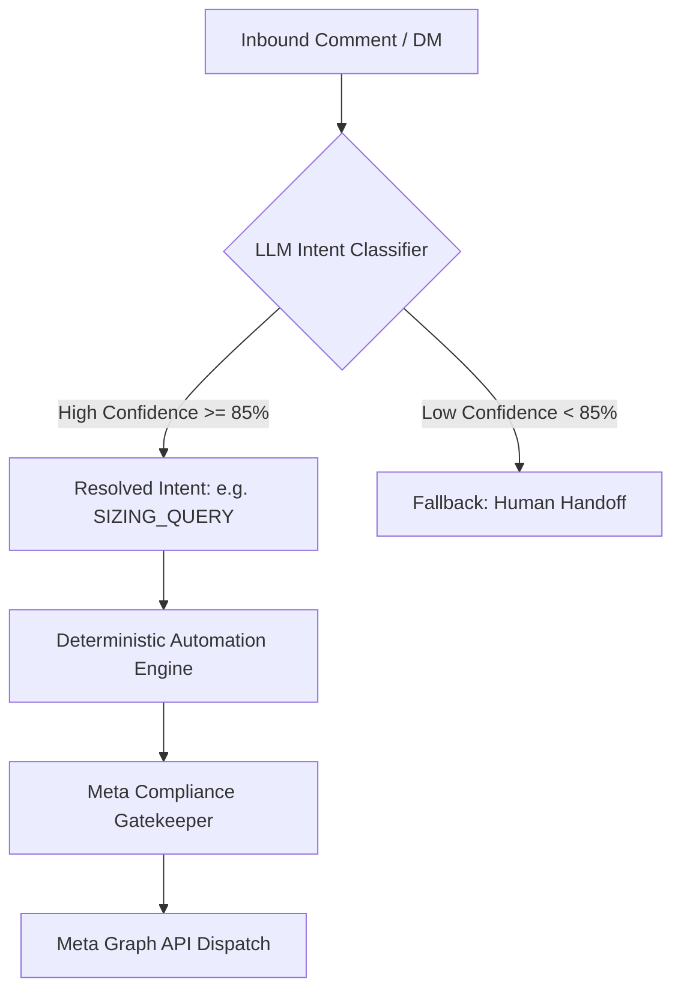

# 09. Implementation Roadmap, AI Intelligence & Future Enhancements

## 1. 13-Phase Engineering Roadmap

```mermaid
gantt
    title XINVORA Engineering Roadmap (Phases 0 to 12)
    dateFormat  X
    axisFormat  Phase %X
    
    section Foundation
    Phase 0: Docs & Spec Approval :0, 1
    Phase 1: Meta OAuth & Channel Adapters :1, 2
    Phase 2: Webhooks & Ingestion Pipeline :2, 3
    
    section Core Commerce
    Phase 3: Product Engine & Content Mapping :3, 4
    Phase 4: Comment-to-DM Engine :4, 5
    Phase 5: Public Reply Randomizer Pools :5, 6
    
    section Reliability & CRM
    Phase 6: Queues, Throttling & Compliance Gate :6, 7
    Phase 7: Admin Dashboard & Dry-Run Simulator :7, 8
    Phase 8: Social CRM & Human Handoff Inbox :8, 9
    
    section Growth & Advanced
    Phase 9: Marketing Drops & Restock Campaigns :9, 10
    Phase 10: Telemetry & Conversion Attribution :10, 11
    Phase 11: Visual Flow Builder & Inventory Sync :11, 12
    Phase 12: AI Layer (Intent & Product Match) :12, 13
```



---

## 2. Detailed Phase Breakdown

| Phase | Milestone Name | Key Deliverables & Validation Criteria |
| :---: | :--- | :--- |
| **0** | **Architecture & Schema** | Finalize schemas, compliance rules, and API payload definitions. |
| **1** | **Meta OAuth Integration** | Complete OAuth 2.0 flow for Instagram Professional & Facebook Pages. |
| **2** | **Webhooks Pipeline** | Signature verification (`X-Hub-Signature-256`), de-duplication idempotency. |
| **3** | **Product & Content Mapping** | Product CRUD, image/URL management, Instagram Reels sync & binding. |
| **4** | **First Automation Workflow** | Inbound comment $\to$ product lookup $\to$ compliant private reply DM. |
| **5** | **Public Reply Engine** | Randomized anti-repetition comment reply pools. |
| **6** | **Reliability & Rate Limiting** | PostgreSQL message queue, exponential backoff, circuit breaker. |
| **7** | **Admin Dashboard** | Product management, automation rules editor, test dry-run simulator. |
| **8** | **Omnichannel Inbox & CRM** | Real-time chat view, contact profiles, human handoff takeover switch. |
| **9** | **Compliant Social Campaigns**| Segmented collection drops and restock alerts within Meta guidelines. |
| **10**| **Analytics & Attribution** | End-to-end funnel dashboards, UTM attribution, click-through rates. |
| **11**| **Visual Builder & Inventory** | Drag-and-drop workflow canvas and real-time stock sync with store. |
| **12**| **AI Intelligence Layer** | Semantic intent classification and smart product matching. |

---

## 3. The AI Intelligence Layer (Phase 12 Architecture)

AI is introduced as a precision classifier **after** the deterministic foundation is rock-solid.



### Key AI Safety Guardrails:
1. **AI never generates unstructured, hallucinatory promises** (e.g. fake discounts or made-up delivery promises).
2. **AI resolves queries into structured intent IDs** which trigger vetted, deterministic response cards.
3. **The Compliance Gate remains between AI output and Meta APIs**—AI cannot bypass messaging windows or rate quotas.

---

## 4. Live Inventory & Catalog Sync (Phase 11)

Connecting live inventory ensures that automated replies are always stock-aware:

```text
Product Inquired: Black Velvet Party Dress
  ├── Available Sizes: ['S', 'M'] (Size 'L' Out of Stock)
  └── Dynamic Response: "Sizes S and M are in stock! Size L is sold out. [ VIEW SIZES ]"
```

---

## 5. Visual Drag-and-Drop Flow Builder (Phase 11)

Allows visual node-based workflow authoring:

```text
[ Reel Comment Trigger ]
          │
          ▼
   [ Intent Filter ] ── (No match) ──► [ End ]
          │
      (Product Request)
          │
          ▼
 [ Compliance Gate Check ]
          │
      (Passed)
          │
          ▼
[ Send Private Reply (Card + Button) ]
          │
          ▼
   [ Wait 15 Minutes ]
          │
          ▼
[ Check: User Responded in DM? ]
     ├── (YES) ──► [ Send Sizing Guide ]
     └── (NO)  ──► [ Safely Terminate ]
```

---

## 6. Official Meta API Sources & References

Always verify updates against official Meta developer documentation:
- [Meta for Developers: Instagram Messaging API Overview](https://developers.facebook.com/docs/messenger-platform/instagram)
- [Instagram Private Replies to Comments](https://developers.facebook.com/docs/messenger-platform/instagram/features/private-replies)
- [Messenger Platform Rate Limits & Policies](https://developers.facebook.com/docs/messenger-platform/overview/rate-limits)
- [Meta Webhooks Ingestion Documentation](https://developers.facebook.com/docs/graph-api/webhooks)
- [Facebook Pages API & Messenger Platform](https://developers.facebook.com/docs/pages-api)
