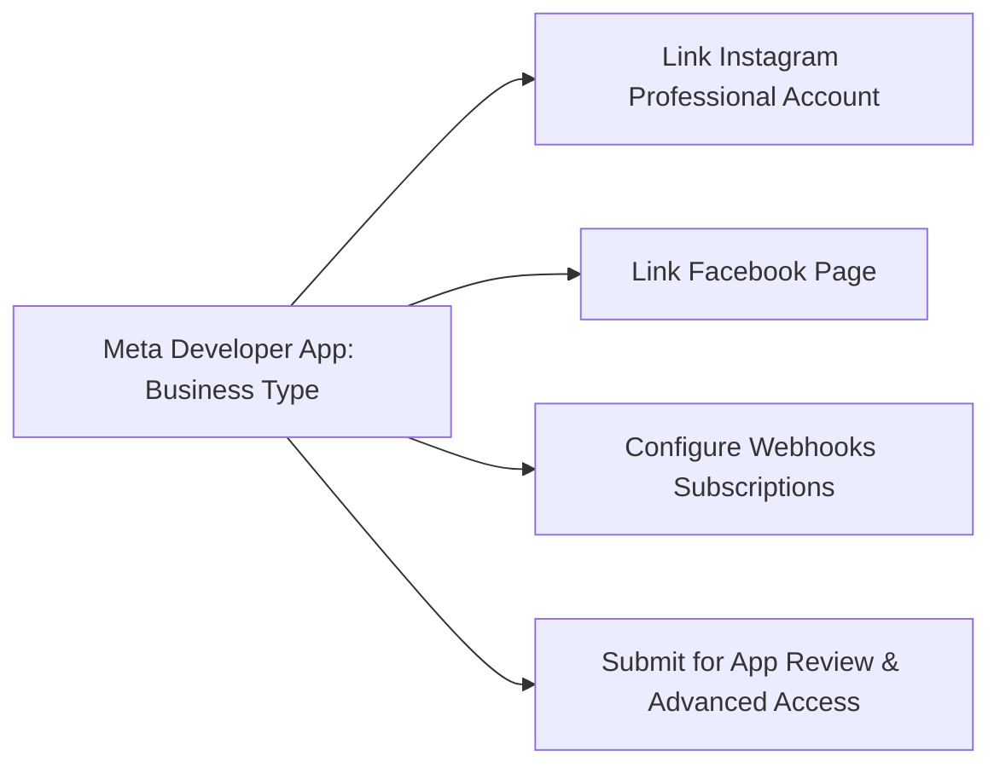

# 11. Meta App Review & Permissions Guide

## 1. Meta Developer Portal Setup

To operate in production, XINVORA requires a registered Meta Developer App with **Business App Type** connected to verified Meta Business Manager accounts.



---

## 2. Required Permissions & Access Tiers

| Meta Permission / Feature | Access Tier Needed | Purpose & User Benefit |
| :--- | :--- | :--- |
| `instagram_basic` | Advanced Access | Read profile info, media list (Reels, Posts) to bind products. |
| `instagram_manage_comments` | Advanced Access | Ingest real-time comment webhooks and post public confirmation replies. |
| `instagram_manage_messages` | Advanced Access | Send automated private replies to commenters and manage live DM threads. |
| `pages_show_list` | Advanced Access | Discover connected Facebook Pages during OAuth flow. |
| `pages_read_engagement` | Advanced Access | Ingest Facebook Page post comments. |
| `pages_manage_posts` | Advanced Access | Reply to public comments on Facebook Page posts. |
| `pages_messaging` | Advanced Access | Send compliant Messenger replies to Facebook users. |

---

## 3. Webhook Subscriptions Required

Under the Meta App Dashboard $\to$ Webhooks:

### Instagram Webhooks:
- `comments`: For receiving comment events on Reels/Posts.
- `messages`: For inbound DM handling and customer care window triggers.
- `messaging_postbacks`: For CTA button click events in DMs.

### Page / Messenger Webhooks:
- `feed`: For Facebook Page comments and status interactions.
- `messages`: For Messenger chat interactions.
- `messaging_optins`: For recurring notification tokens.

---

## 4. App Review Submission Guidelines & Screencast Preparation

Meta requires a video screencast and explicit explanation for each requested permission before granting **Advanced Access** (allowing non-admin public users to interact).

### Screencast Walkthrough Script:
1. **Show OAuth Login:** Show the admin logging into the XINVORA dashboard and granting Meta permissions.
2. **Show Product Binding:** Show an admin assigning product SKU `DRESS-001` to an Instagram Reel.
3. **Show Inbound Comment:** Open Instagram app with a test account, navigate to the XINVORA Reel, and comment `"LINK"`.
4. **Show Automated Private Reply:** Switch to the test account's Direct Messages to show the immediate receipt of the product card with the `"VIEW PRICE"` button.
5. **Show Public Reply:** Refresh the Reel comments to show the randomized public reply (*"Details sent to your DM! ✨"*).
6. **Show Human Handoff:** In DM, reply *"Can I speak to someone?"*, open the XINVORA admin inbox, show the status changing to `NEEDS_ATTENTION`, and show an agent replying manually.

### Sample App Review Notes (For Reviewer):
```text
XINVORA is a boutique social commerce brand. Our application connects our official 
Instagram Professional account and Facebook Page to our product catalog.

How instagram_manage_messages is used:
When customers view our product showcase Reels and comment asking for pricing or 
links (e.g. "link", "price"), our app uses the official Meta Instagram Private 
Reply endpoint to send them a direct product card with accurate pricing and a 
direct link to our website. 

How instagram_manage_comments is used:
We use this to listen for product inquiries on our posts and reply publicly to 
confirm that product details have been sent to their inbox, preventing comment clutter.

Compliance & Safety:
We strictly enforce Meta's 7-day single private reply limit and the 24-hour customer 
care messaging window. Users can opt-out at any time, and automation immediately halts 
when human support is requested.
```

---

## 5. Mandatory Legal & Meta Compliance Endpoints

Meta mandates public endpoints before submitting for review:

1. **Privacy Policy URL:** `${NEXT_PUBLIC_APP_URL}/privacy` or `https://<your-store-domain>/privacy` (explicitly stating Meta user data handling, no scraping, and storage limits).
2. **Terms of Service URL:** `${NEXT_PUBLIC_APP_URL}/terms` or `https://<your-store-domain>/terms`.
3. **User Data Deletion Callback URL:** `${NEXT_PUBLIC_APP_URL}/api/compliance/data-deletion` (implements Meta's Data Deletion Request Callback standard with status tracking code).
