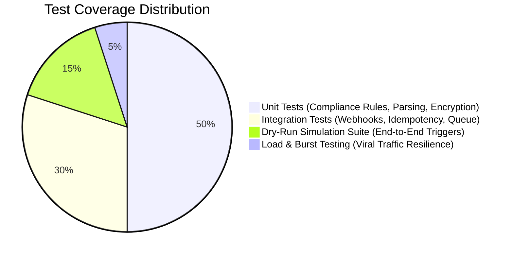

# 13. Testing, QA & Simulation Guide

## 1. Testing Strategy & Test Pyramid



---

## 2. Unit Testing: Core Compliance & Logic

Unit tests focus on ensuring that the Compliance Gatekeeper and rate limiters cannot fail silently or allow invalid messages.

### Sample Test: Compliance Window Enforcement (Jest / Vitest)
```typescript
import { ComplianceGatekeeper } from '@/lib/compliance';

describe('ComplianceGatekeeper', () => {
  it('should allow Instagram Private Reply within 7 days for 1st message', async () => {
    const result = await ComplianceGatekeeper.evaluate({
      channel: 'INSTAGRAM',
      actionType: 'COMMENT_PRIVATE_REPLY',
      commentCreatedAt: new Date(Date.now() - 3 * 24 * 60 * 60 * 1000), // 3 days old
      previousPrivateRepliesSent: 0
    });
    expect(result.allowed).toBe(true);
  });

  it('should block Instagram Private Reply if comment is older than 7 days', async () => {
    const result = await ComplianceGatekeeper.evaluate({
      channel: 'INSTAGRAM',
      actionType: 'COMMENT_PRIVATE_REPLY',
      commentCreatedAt: new Date(Date.now() - 8 * 24 * 60 * 60 * 1000), // 8 days old
      previousPrivateRepliesSent: 0
    });
    expect(result.allowed).toBe(false);
    expect(result.reason).toBe('EXPIRED_7_DAY_WINDOW');
  });

  it('should block 2nd Private Reply on the same comment', async () => {
    const result = await ComplianceGatekeeper.evaluate({
      channel: 'INSTAGRAM',
      actionType: 'COMMENT_PRIVATE_REPLY',
      commentCreatedAt: new Date(),
      previousPrivateRepliesSent: 1 // Already replied once
    });
    expect(result.allowed).toBe(false);
    expect(result.reason).toBe('DUPLICATE_PRIVATE_REPLY_PROHIBITED');
  });
});
```

---

## 3. Mocking Inbound Meta Webhooks (cURL)

Developers can simulate inbound comment webhooks locally by sending signed requests to `/api/webhooks/meta`:

```bash
# 1. Generate SHA256 Signature of JSON payload
PAYLOAD='{"object":"instagram","entry":[{"id":"17841400000","time":1772098800,"changes":[{"field":"comments","value":{"id":"comment_test_99","text":"link please","from":{"id":"user_123","username":"tester"},"media":{"id":"reel_42"}}}]}]}'
SECRET="your_meta_app_secret_hex"
SIGNATURE=$(echo -n "$PAYLOAD" | openssl dgst -sha256 -hmac "$SECRET" | sed 's/^.* //')

# 2. Dispatch Mock Webhook Request
curl -X POST http://localhost:3000/api/webhooks/meta \
  -H "Content-Type: application/json" \
  -H "X-Hub-Signature-256: sha256=$SIGNATURE" \
  -d "$PAYLOAD"
```

---

## 4. Viral Traffic Load & Burst Testing

To verify that the ingestion and queue pipeline does not buckle under viral Reel traffic:

- **Scenario:** 5,000 comments arrive over a 60-second window.
- **Expectation:**
  1. All 5,000 webhook requests return `HTTP 200 OK` in `< 300ms`.
  2. Exactly 5,000 jobs are enqueued in `message_jobs`.
  3. No double-replies are created (Idempotency handles duplicates).
  4. Outbound dispatch conforms to rate limit ($\le 120\text{ calls/minute}$ per account).
  5. Zero unhandled exceptions or connection pool exhaustion on Supabase.

---

## 5. Pre-Release QA Verification Checklist

Before deploying any new version to production, verify:
- [ ] Meta Webhook verification handshake (`hub.challenge`) passes.
- [ ] OAuth connect and token refresh jobs execute successfully.
- [ ] Inbound comment generates exactly one private reply and one public reply.
- [ ] Repeated identical comments from the same user on the same Reel do not produce duplicate DMs.
- [ ] Clicking "Needs Attention" in the Inbox immediately silences automated responses.
- [ ] Product SKU links in DMs include correct UTM parameters.
- [ ] Compliance decision audit logs are correctly populated for every attempt.
